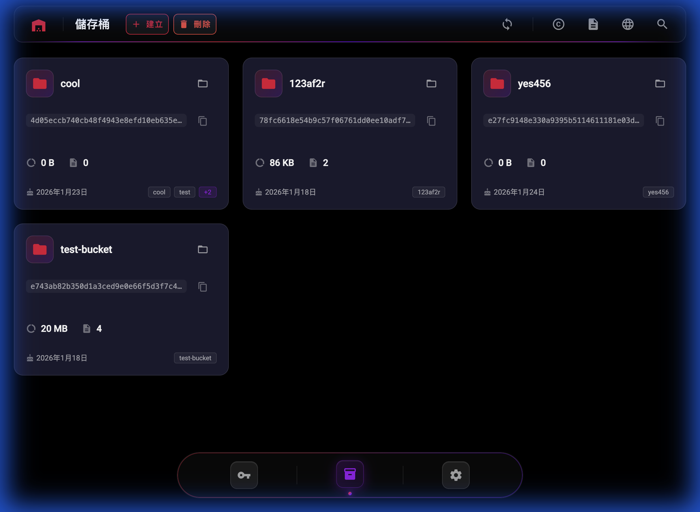
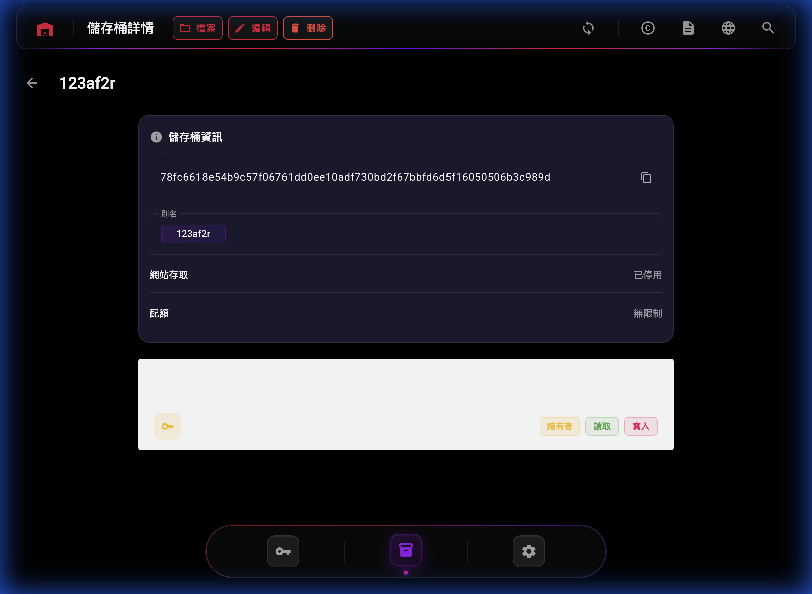
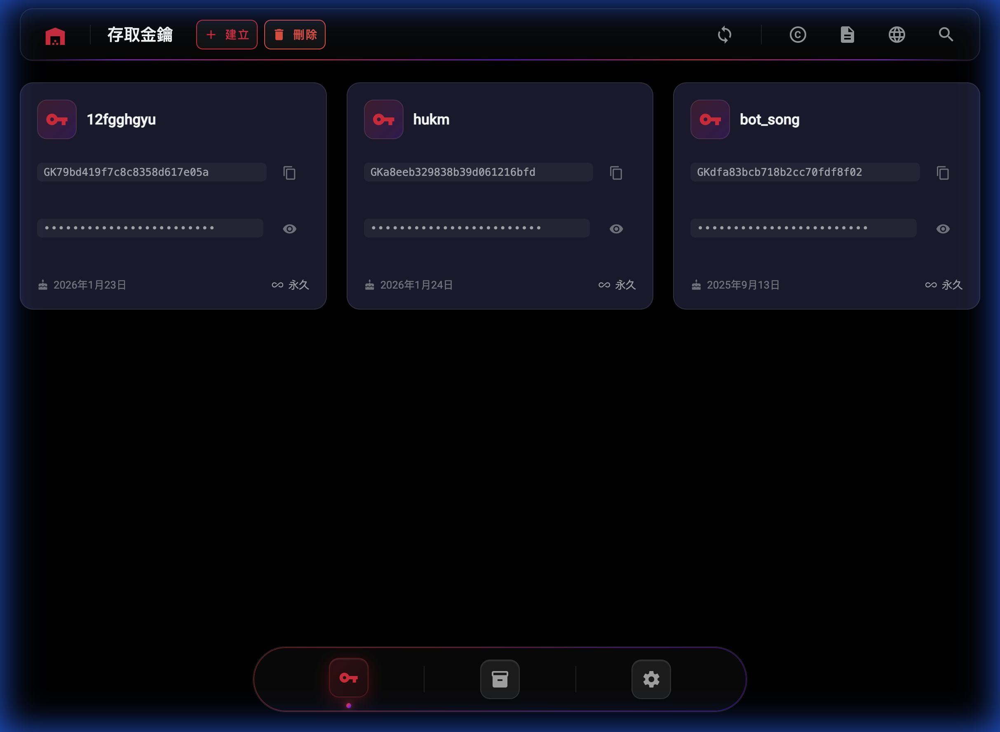

# Garage UI

A modern, responsive web interface for [Garage](https://garagehq.deuxfleurs.fr/) - the open-source distributed object storage system compatible with Amazon S3.

[](https://opensource.org/licenses/MIT)
[](https://rust-lang.org/)
[](https://nodejs.org/)
---



## Features

- **Bucket Management**: Create, edit, and delete buckets with alias, quota, and website access settings
- **Access Key Management**: Manage S3 access keys with full permission control
- **Object Browser**: Navigate, upload, and download objects in your buckets
- **Permission Management**: Fine-grained control over bucket access permissions
- **Modern UI**: Dark theme with responsive design built with Angular Material
- **Multi-language Support**: Traditional Chinese and English

## Screenshots

### Bucket List
Overview of all your storage buckets with key information at a glance.


### Bucket Detail
Detailed view of bucket settings, including aliases, quotas, and access permissions.



### Access Key List
Manage your S3 access keys for API access.



## Architecture

See [ARCHITECTURE.md](ARCHITECTURE.md) for detailed architecture documentation.

## Quick Start

### Prerequisites

- [Rust](https://www.rust-lang.org/) (1.93.0+)
- [Node.js](https://nodejs.org/) (24.11.0+)
- [Garage](https://garagehq.deuxfleurs.fr/) instance with admin API access
- [Redis](https://redis.io/) thumbnail store

### Backend Setup

1. Copy `.env.sample` to `.env` and configure:
   ```bash
   cp .env.sample .env
   ```

2. Build and run:
   ```bash
   cargo build --release
   cargo run
   ```

### Frontend Setup

1. Install dependencies and run:
   ```bash
   cd frontend
   npm i
   npm run dev
   ```

2. Open http://localhost:3000 in your browser

## Development

### Regenerating Protobuf Code

Backend:
```bash
cargo clean && cargo build
```

Frontend:
```bash
cd frontend
npm run proto
```

### Running Tests

```bash
# Backend tests
cargo test

# Frontend (if configured)
cd frontend && npm test
```

## Tech Stack

### Backend
- **Rust** with Tokio async runtime
- **Tonic** for gRPC
- **Domain-Driven Design** (Aggregates, Value Objects, Repository Pattern)
- **CQRS** (Command Query Responsibility Segregation)

### Frontend
- **Angular 21** with Signals
- **Angular Material** component library
- **Hono.js** BFF (Backend-for-Frontend)
- **gRPC-Web** for backend communication

## License

This project is licensed under the MIT License - see the [LICENSE](LICENSE) file for details.
